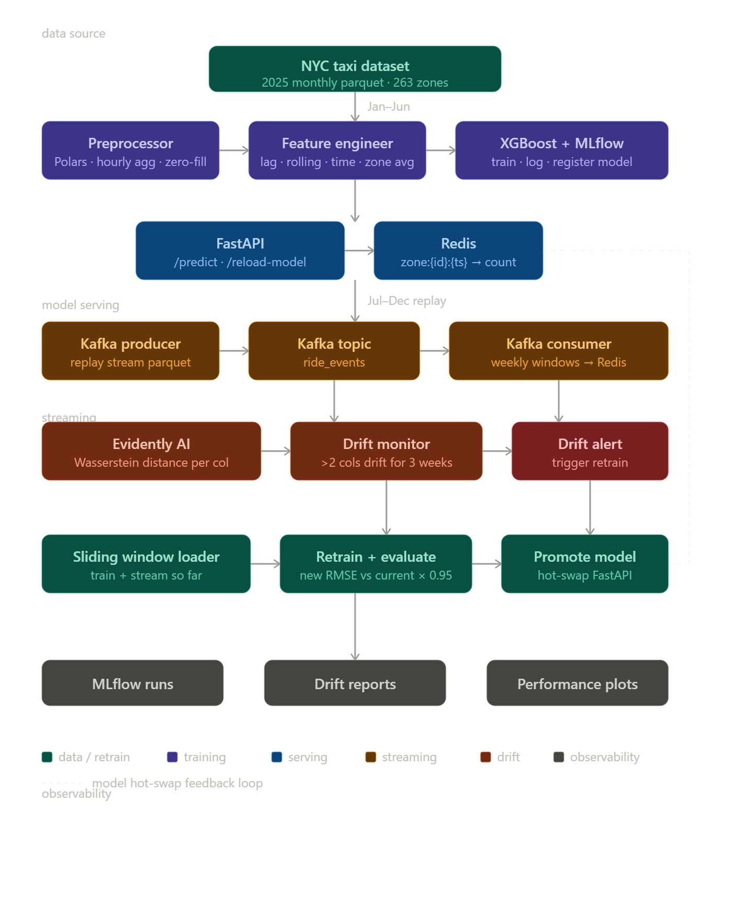

# Ride Demand Forecasting System

A production-grade ML system that forecasts NYC yellow taxi demand per zone per hour, with real-time streaming, automated drift detection, and self-healing retraining.

---

## Architecture


## Results

| Run | Training Data | Val RMSE | Promoted |
|-----|--------------|----------|----------|
| Base model | Jan–Jun 2025 | 9.19 | ✓ (initial) |
| Retrain Aug 17 | Jan–Jun + Jul–Aug | 7.88 | ✓ |
| Retrain Sep 14 | Jan–Jun + Jul–Sep | 9.03 | ✗ |
| Retrain Nov 02 | Jan–Jun + Jul–Nov | 9.85 | ✗ |

Concept Drift Detected

**Best deployed model RMSE: 7.88** — 14% improvement over baseline.

Baseline comparisons (validation set):

| Naive Baseline | RMSE |
|----------------|------|
| lag_1h | 15.91 |
| lag_24h | 22.40 |
| lag_168h | 14.84 |
| **XGBoost (best)** | **7.88** |

---

## Tech Stack

| Layer | Technology |
|-------|-----------|
| Data processing | Polars, PyArrow |
| Feature engineering | Polars (lag, rolling, time features) |
| Model | XGBoost with native categorical support |
| Experiment tracking | MLflow |
| Serving | FastAPI + Uvicorn |
| Feature store | Redis |
| Streaming | Apache Kafka |
| Drift detection | Evidently AI |
| Infrastructure | Docker Compose |

---

## Project Structure

```
ride-demand-forecast/
├── data/
│   ├── raw/                          ← monthly parquet files
│   ├── processed/                    ← train.parquet, stream.parquet
│   └── reference/                    ← Evidently baseline snapshots
│       ├── reference_original.parquet
│       └── reference_current.parquet
├── src/
│   ├── data/
│   │   ├── downloader.py             ← fetch NYC taxi parquet files
│   │   └── preprocessor.py          ← clean, aggregate, split
│   ├── features/
│   │   ├── engineer.py              ← lag, rolling, time features
│   │   └── schema.py                ← feature contract for serving
│   ├── training/
│   │   ├── train.py                 ← XGBoost + MLflow logging
│   │   └── evaluate.py              ← metrics, prediction plots
│   ├── serving/
│   │   ├── api.py                   ← FastAPI endpoints
│   │   ├── model_loader.py          ← thread-safe model hot-swap
│   │   └── feature_store.py         ← Redis lag feature lookup
│   ├── streaming/
│   │   ├── producer.py              ← replay stream → Kafka
│   │   └── consumer.py             ← Kafka → Redis + drift check
│   ├── monitoring/
│   │   ├── drift_detector.py        ← Evidently weekly drift reports
│   │   └── alerts.py               ← drift alert logging
│   └── retraining/
│       └── pipeline.py             ← sliding window retrain + promote
├── infra/
│   └── docker-compose.yml           ← Kafka, Zookeeper, Redis, MLflow
├── notebooks/
│   └── performance_analysis.ipynb   ← before/after drift plots
├── artifacts/
│   ├── plots/                       ← forecast and drift plots
│   └── drift_reports/               ← Evidently HTML reports
├── scripts/
│   └── reset_pipeline.py            ← clean rerun from scratch
└── config.py                        ← all thresholds and paths
```

---

## Quickstart

### Prerequisites

- Python 3.11+
- Docker Desktop

### 1. Install dependencies

```bash
pip install -r requirements.txt
```

### 2. Start infrastructure

```bash
cd infra
docker-compose up -d
```

Starts Kafka, Zookeeper, Redis, and MLflow on their default ports.

### 3. Download data

```bash
python src/data/downloader.py
```

Downloads all 12 months of NYC Yellow Taxi 2025 parquet files to `data/raw/`.

### 4. Preprocess

```bash
python src/data/preprocessor.py
```

Cleans, aggregates to hourly zone-level demand, fills missing hours with zero. Outputs `train.parquet` and `stream.parquet`.

### 5. Build features and train

```bash
python src/training/train.py
```

Builds lag and rolling features, trains XGBoost, logs everything to MLflow at `http://localhost:5000`.

### 6. Start serving

```bash
python src/serving/api.py
```

FastAPI available at `http://localhost:8000`. Test:

```bash
curl -X POST http://localhost:8000/predict \
  -H "Content-Type: application/json" \
  -d '{"zone_id": 237, "pickup_hour": "2025-07-01T09:00:00"}'
```

### 7. Start streaming and drift detection

Terminal 1 — producer:
```bash
python src/streaming/producer.py
```

Terminal 2 — consumer (triggers drift detection and retraining automatically):
```bash
python src/streaming/consumer.py
```

### 8. Reset pipeline for fresh run

```bash
python scripts/reset_pipeline.py
```

---

## Feature Engineering

| Feature | Description |
|---------|-------------|
| `hour_of_day` | Hour extracted from pickup timestamp (0–23) |
| `day_of_week` | Day of week (0=Monday, 6=Sunday) |
| `month` | Month number (1–12) |
| `is_weekend` | Boolean: day_of_week >= 5 |
| `is_rush_hour` | Boolean: hour in [7,8,9,17,18,19] |
| `lag_1h` | Trip count in same zone 1 hour ago |
| `lag_24h` | Trip count in same zone 24 hours ago |
| `lag_168h` | Trip count in same zone 168 hours ago (same hour last week) |
| `rolling_mean_3h` | Mean trip count over last 3 hours per zone |
| `rolling_mean_24h` | Mean trip count over last 24 hours per zone |
| `rolling_std_24h` | Std of trip count over last 24 hours per zone |
| `rolling_std_168h` | Std of trip count over last 168 hours per zone |
| `zone_hour_avg` | Historical mean demand for this zone at this hour of day |
| `PULocationID` | Zone ID (treated as categorical by XGBoost) |

All lag and rolling features are computed per zone — never across zones.

---

## Drift Detection

Drift is detected using Evidently AI on weekly windows of stream data.

**What is monitored:** Hourly city-wide demand aggregates:
- `total_demand` — sum of trips across all zones per hour
- `avg_demand` — mean trips per zone per hour
- `std_demand` — demand volatility per hour
- `peak_demand` — maximum zone demand per hour

**Drift metric:** Wasserstein distance per column. Values above `0.1` indicate meaningful distributional shift.

**Retraining trigger:** More than 2 columns drifting above threshold for 3 consecutive weekly windows. One calm week does not reset the counter — requires 2 consecutive calm weeks to reset.

**Reference versioning:** Original reference (Jan–Jun distribution) is preserved at `reference_original.parquet` and never overwritten. After each successful retrain, `reference_current.parquet` is updated to reflect the new training distribution.

---

## Model Promotion Logic

After retraining, the new model is only promoted if:

```
new_val_rmse < current_val_rmse × 0.95
```

A 5% improvement is required to justify replacing the deployed model. If the new model doesn't clear this bar it is logged to MLflow but discarded. The current best model stays in production.

---

## Observations

The system detected sustained concept drift from September onwards as demand patterns shifted with seasonal changes. The August retrain improved RMSE from 9.19 → 7.88 (14% improvement) by incorporating summer patterns. Subsequent retrains were rejected as validation RMSE climbed back toward baseline due to unseen holiday demand patterns — a known limitation of single-year training data.

In production this would be addressed with:
- Multi-year historical data to capture full seasonal cycles
- Separate models per season or a seasonal decomposition step
- Lower `RMSE_IMPROVEMENT_THRESHOLD` during sustained drift periods

---

## API Reference

### `POST /predict`

```json
{
  "zone_id": 237,
  "pickup_hour": "2025-07-01T09:00:00"
}
```

Response:
```json
{
  "zone_id": 237,
  "pickup_hour": "2025-07-01T09:00:00",
  "predicted_demand": 321.4,
  "model_version": "latest"
}
```

### `POST /reload-model`

Hot-swaps the serving model and zone-hour averages without restarting FastAPI.

### `GET /health`

```json
{
  "status": "ok",
  "model_version": "latest"
}
```

---

## Future Improvements

- Per-zone drift detection for high-traffic zones (JFK, Midtown, UES)
- Multi-year training data for full seasonal coverage
- Weather feature integration via open-meteo API
- Prometheus + Grafana dashboard for real-time monitoring
- Kubernetes deployment with horizontal pod autoscaling
- Shadow mode evaluation — run new model in parallel before promoting

---

## Author

Anjaneya Javvadi· [github.com/anjaneyajavvadi](https://github.com/anjaneyajavvadi)